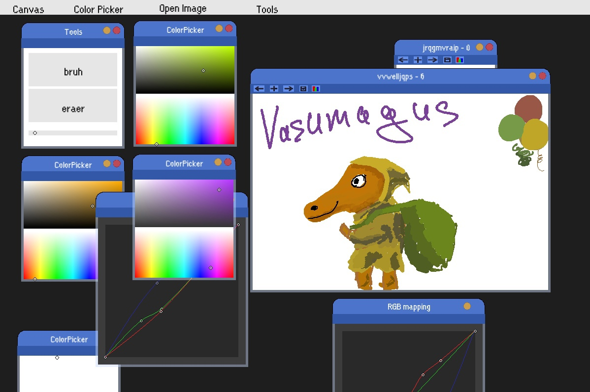
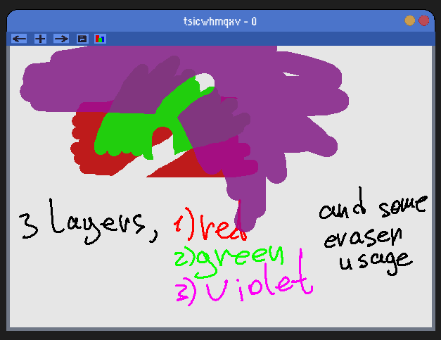
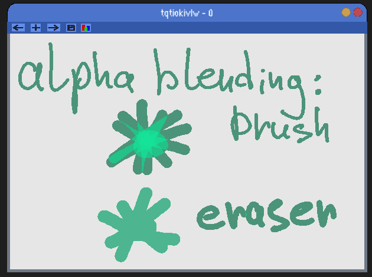
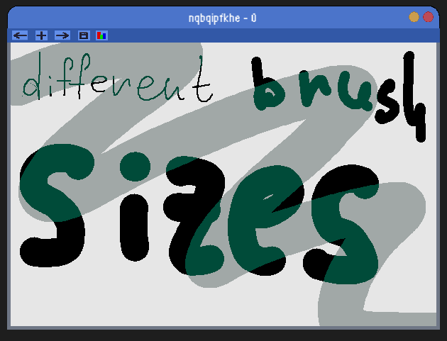
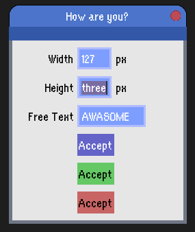
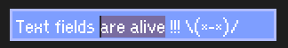
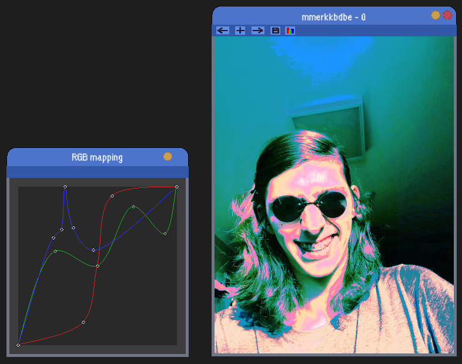

# moga_engine
open engine for smol games &amp; apps

An abstract hierarchical system of events dispatching and UI managing. Buttons, sliders, text fields, draggable windows with easily customizable reactions on different events are supported. Each UI element can be textured with pictures / animations. Image editor as an example of engine usage.

For now image editor supports canvas with many layers, clever transparency usage, save button, color picker abstract effects for layers, dialog windows, tab & shift-tab in dialogs and any selectable buttons. Let's cover these features one by one.

Top features one by one:

Example of the rgb_mapping effect

